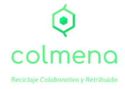
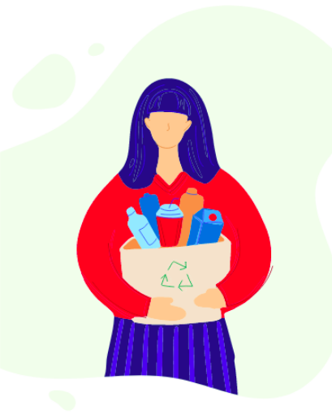

## ¿Qué es colmena?

Colmena es una plataforma que conecta a la comunidad a través de la recuperación de residuos.

Esto es posible gracias a una aplicación móvil y los recursos que tenemos en nuestros domicilios.

Los usuarios pueden buscar, registar, gestionar y registrar sus residuos. Pueden interactuar con otros usuarios de su comunidad, ya sean recolectores o transportistas en un espacio público o privado.

## Recuperar residuos

Es una de las acciones principales de la plataforma, permite informar la cantidad de residuos recuperados por tipo (PET, orgánico, etc).

## Transportar residuos

Una vez registrados los residuos la aplicación permite llevar los mismos al centro de reciclaje más cercano o conectar con otro usuario que se ofrece a llevar los residuos a dicho lugar.

