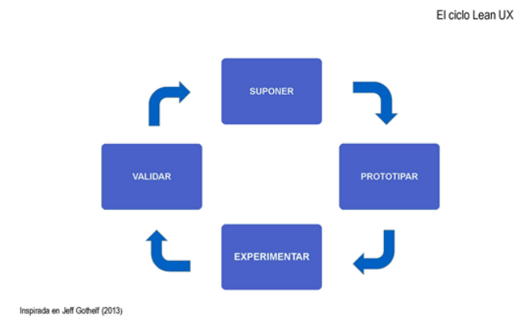
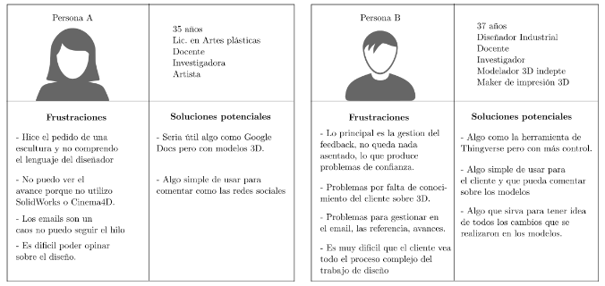
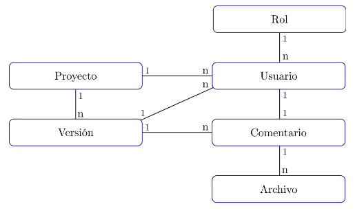

## Acerca de la metodología

## 1. Declaración del problema

Permite centrar correctamente el trabajo de todo el equipo y define las restricciones y límites necesarios para que no se pierda  de vista el objetivo.

### Plantilla
[El servicio/producto] debe cumplir con [estos objetivos]. Sin embargo, se ha observado que no se están alcanzando [estos objetivos], lo que está causando [este efecto adverso] para los usuarios. ¿Cómo se podría mejorar el  [servicio/producto] de modo que los usuarios consigan mejorar sus resultado según [estos criterios cuantificables o cualificables]

## 2. Lista de suposiciones

Una suposición es una declaración de alto nivel que se considera cierta. Este ejercicio se realiza en equipo,  asegurándose de que todas las disciplinas estén representadas. Se recopilan las declaraciones que reflejen lo que el equipo de desarrollo considere cierto respecto a la solución o producto.

Responder estas preguntas en una lista de suposiciones:
### a- ¿Quiénes son los usuarios del producto? (Personas)

### b- ¿Cómo encaja el producto en su trabajo/actividad?
### c- ¿Qué problemas soluciona la app al usuario?
### d- ¿Cuáles son las funciones más importantes que debería tener?
### e- ¿Qué aspecto debe tener y cómo debe comportarse?

## 3. Hipótesis

descripciones más detalladas de las suposiciones, dirigidas a áreas específicas del producto o flujos de trabajo con las que se puede experimentar (PMV). Es decir, se transforman las suposiciones a un formato más sencillo de probar. Sin embargo, las hipótesis suelen ser demasiado extensas para que, con una única prueba, se pueda determinarse su validez. Contiene demasiadas partes, es decir, demasiadas sub-hipótesis. Para  registrar estas partes más pequeñas y específicas se utiliza la siguiente
### Plantilla:
Se considera que [haciendo esto, desarrollando esta función, creando esta experiencia de usuario] para [estas  personas] se conseguirá [este resultado].
Se sabrá si esto es correcto cuando se obtenga [esta medida cuantitativa, o este conocimiento cualitativo]
El primer campo se completa con la función o mejora para el producto. El segundo describe exactamente qué usuarios objetivo se beneficiarán de la función. El último, especifica los beneficios que esos usuarios obtendrán de ella. La frase final lo une todo. Esta frase determina si la hipótesis es cierta o no.

### Tabla de hipótesis
| # | Se desarrolla (función) | Para (persona) | Para (Solución) |
| --- | --- | --- | --- |
| 1 | Visor de X | Para persona A y persona B | Solucionar de forma eficiente la visualización de X |
| 2 | Sistema de comentarios | Para persona A y B | Discutir sobre los avances |

# PMV

Se compone de Sketches, Wireframes, diseños, prototipos. Usabilidad, etc.

