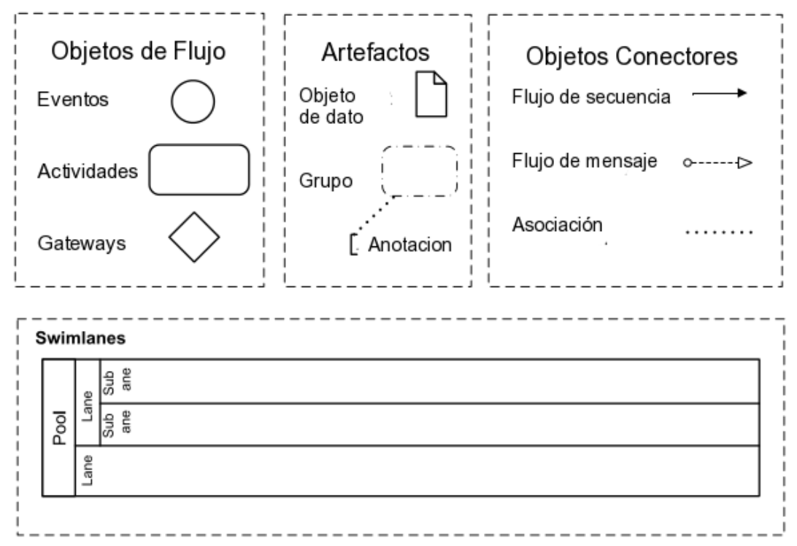

## Acerca de la metodología

Un proceso de negocio es un conjunto de actividades que toman uno o más tipos de entrada y crean una salida que es de valor para el cliente.

BPMN surge como una manera de acordar una notación grafica para representar un proceso de modo de que cada símbolo  tenga un significado unívoco.

## Elemento de BPMN

Un diagrama de proceso de negocio o BPD (Business Process Diagram) está compuesto por un conjunto de elementos gráficos. Los elementos utilizados para construir los diagramas fueron elegidos para ser distinguibles unos de otros y utilizar las figuras que son familiares a la mayoría de los diseñadores.

Los objetos de flujo son los componentes básicos de un BPD, incluyen eventos, actividad y gateways. Las ocurrencias en el mundo real que son relevantes para el proceso se conocen como eventos. Las actividades representan unidades de trabajos. Los gateways son usados para representar convergencia o bifurcación del flujo entre actividades, procesos y gateways.

Los artefactos son usados para mostrar información adicional acerca del proceso de negocio que no es relevante para el flujo. Cada artefacto puede ser asociado con un objeto de flujo. Éstos tienen solo fines informativos, la semántica de ejecución no está asociado a ellos.

Los data objects están representados solo por un nombre, la estructura interna del mismo no está definida en el estándar. Su propósito principal es documentar qué dato es usado en el proceso. Al modelar el proceso se puede representar el dato leído o escrito por una actividad.

Las anotaciones documentan un aspecto específico del proceso en forma textual. El texto es asociado gráficamente con el objeto que explica. Los grupos no tienen una definición formal, tienen un propósito de documentación del proceso.

Los objetos de conexión conectan objetos de flujo, swimlanes (pools y/o lanes) y artefactos. El flujo de secuencia es usado para especificar el orden de los objetos de flujo, mientras que el flujo de mensaje describe el intercambio de mensajes entre actores involucrados del proceso representados por pools. Las asociaciones son un tipo específico de conexión usado para vincular artefactos en el BPD.

Para especificar “quién hace qué” se ubican los procesos en pools, que denota quién hace la tarea. A la vez, un pool se puede particionar en lanes. Típicamente un pool representa a toda la organización mientras que un lane representa a un departamento o un rol dentro de la misma
