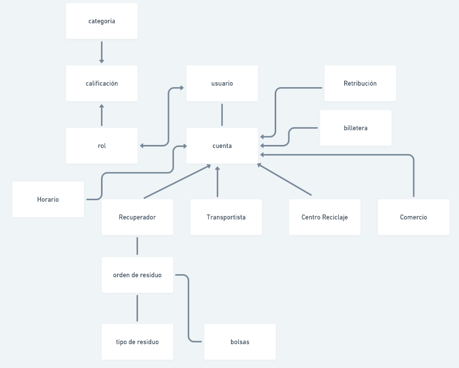

- 1 - Registrar los residuos
- 2 - Informar que voy a transportar (estoy saliendo con que contenedores, desde donde y hacia dónde)
	- Los contenedores pasan a un estado “En transito”
	- Transportista anuncia llegada al centro de Reciclaje (Se asume que entrega lo que esta registrado)
	- Los contenedores pasarian al estado Entregado
- 3 - Transferir los residuos al usuario "Centro de reciclaje"
	- El aceptado registra cantidad
	- El rechazo tiene un motivo

