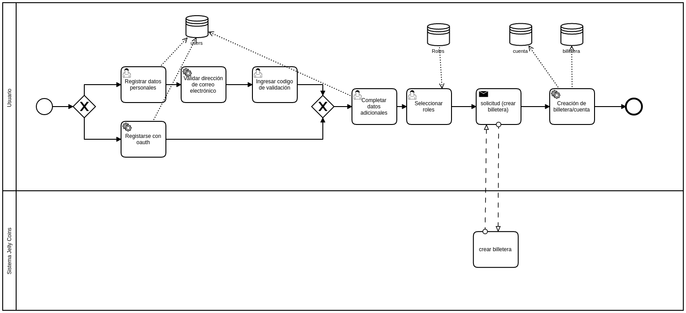

## Detalles del proceso

### Registrar datos personales

- Name
- Last_name
- Login
- Password
- Email

### Validar dirección de correo electrónico:
Se envía un mail con un código de confirmación- 2FA

### Ingresar código de validación

- Code

### Registrarse con oauth:
Opción que permitirá registro con gmail o redes sociales

### Completar datos adicionales

- Street
- City
- State
- Country
- Avatar_image
- About_me
- Facebook
- Twitter
- Instagram
- Personal site
- Horario disponible (por cuenta)

### Seleccionar roles:
Listado de roles con su descripción (puede seleccionar más de uno)

#### 1. Recuperador (Separa/recupera residuos, puede tener transporte propio y querer transportar sus propios activos en principio)
- Hereda de usuario

#### 2. Recolector - es quien realiza la logística (información de Vehículo, capacidad, )
- Hereda de usuario
- Datos del vehículo:
	- Marca
	- Color
	- Tipo/Capacidad (bicicleta, motocicleta, automovil, camioneta, camión, etc)

#### 3. Centro de Reciclaje: realiza procesamiento (para la beta se creará solo un centro de reciclaje)
- Hereda de usuario
- LatLong
- Procesa = si

#### 4. Punto verde: acopio sin procesamiento (esto no se usará en versión beta)
- Hereda de usuario
- LatLong
- Procesa = no

#### 5. Key Stakeholder (comercio-municipalidad-es el eslabón final del circuito económico, quema tokens - no recircula)

### Creación de billetera:
Por cada rol se creará una cuenta asociada al rol y usuario. No puede tener más de una cuenta de cada rol.

