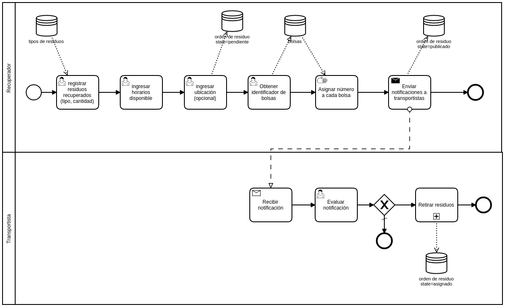

## Detalle del proceso

### Tipo de residuos:
- Plástico, tetra pack, aluminio, orgánico, etc.

### Orden de residuo
- Numero de orden
- Fecha y hora de creación
- Recuperador (creador)
- Cantidad de bolsas
- Tipo de residuo
- <s>Horario disponible</s>
- Ubicación (opcional, sino se ingresa se toma la del registro de usuario)
- Bolsas
- State
	- Pendiente: el recuperador está completando los datos necesarios
	- Publicado: Se completaron todos los datos y se envía mensaje a todos los transportistas notificando que hay una orden pendiente
	- Asignado: un transportista tomó la orden
- <s>Fecha y hora publicación</s> (fecha y hora de cambios de estado va en un registro de auditoria)
- <s>Fecha y hora asignado</s>

### Bolsa
- Número de orden de residuo
- Número de bolsa (ID)
- State
	- Pendiente: se crea la bolsa con un número identificador
	- Retirado: el transportista retiró la bolsa
	- Entregado: la bolsa fue entrega al CR
	- Procesado: el CR procesó la bolsa

### Asignar identificación a cada bolsa:
La identificación estará compuesta por el COD Usuario, número de la orden de residuo + número de bolsa que empieza en 1 y es autoincremental. Cuando sea un nueva orden se vuelve a setear en 1, por ejemplo: OR0111.01, OR0111.02 ... OR0111.n, OR0222.01, OR0222.02 …

### Enviar notificaciones a transportista:
Se realiza un push a todos los usuarios que tengan el rol transportista en ese momento.

### Recibir notificación
### Evaluar notificación:
Si un transportista acepta la orden de retiro de residuo, automáticamente deshabilita la opción para otros transportistas. La orden de residuo cambia su estado a asignado. Luego se dispara el proceso retirar residuo

### Orden de Residuo (parte 2)
- Transportista
- Fecha y hora de retiro
- Categoría de calificación
	- Nombre
	- Descripción
	- Rol (opcional, si no está asignado vale para todos)
- Calificaciones
	- Categoria
	- Puntaje: del 1 al 5
	- User_calificador
	- user_calificado

