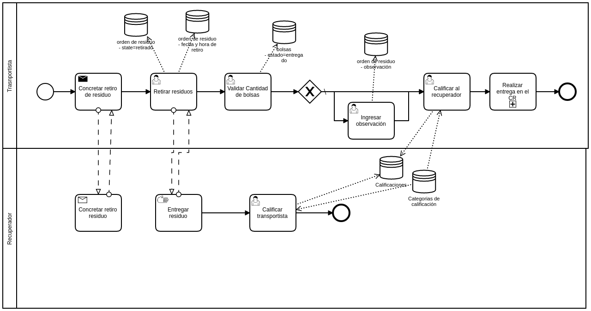

## Detalle del proceso
### Concretar retiro de residuo:
Canal de comunicación entre el transportista y el recuperador
### Retirar residuo:
Confirmación de cuando el transportista retiró los residuos del domicilio del recuperador, se almacena fecha y hora en que se generó esta acción. El estado de la orden de residuo pasa a retirado.
### Entregar residuo:
Actividad manual que refleja que el recuperador entregó los residuos.
### Calificar al transportista:
Se puede calificar del 1 al 5 por diferentes categorías (Embalaje, puntualidad, amabilidad, etc)
### Validar cantidad de bolsas:
Se realizará un picking con los números de bolsas para que marque cuales recibió.
### Ingresar observación:
Si alguna bolsa no se entregó o no estaba en buenas condiciones, se puede ingresar una observación.
### Calificar al recuperador:
Se puede calificar del 1 al 5 por diferentes categorías (puntualidad, amabilidad, etc)

