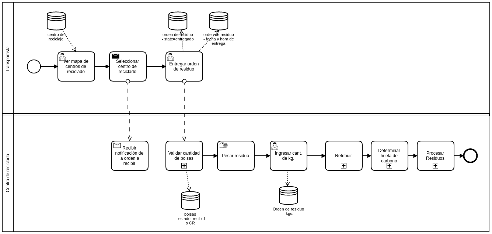

## ¿Qué es un centro de reciclado?
Son puntos donde se reciben los residuos y se procesan para darle un valor agregado.

## ¿Que es un punto verde?
Son estaciones ubicadas en casas, galpones o instituciones para que puedas acercar tus reciclables (Botellas PET) para almacenaje.

**En el MVP para no complejizar el punto verde será el centro de reciclaje**

## Detalle del proceso

### Ver mapa de centro de reciclado:
Para la beta se operará solo con un centro de residuo
### Seleccionar centro de reciclado:
Esta acción envía una notificación al centro de reciclado
### Entregar orden de residuo:
Confirmación de cuando el transportista entregó los residuos al centro de reciclaje, se almacena fecha y hora en que se generó esta acción. El estado de la orden de residuo pasa a entregado.
### Validar cantidad de bolsas:
Subproceso similar al que hace el RECOLECTOR cuando retira las bolsas del recuperador.
### Pesar residuo:
actividad manual
### Ingresar cantidad de kg.:
Se almacena la cantidad pesada en la orden, con esto se definirá la retribución para el recuperador.
### Retribuir:
Ver [subproceso](proceso5.md)
### Determinar huella de carbono:
Ver subproceso
### Procesar residuo:
Ver subproceso

## GreenPoint
- name
- description
- iconFileUrl
- latLng
- code. (Identificación administrativa. Por ejemplo CVCR01 Campo Viera Centro Reciclaje 01)

