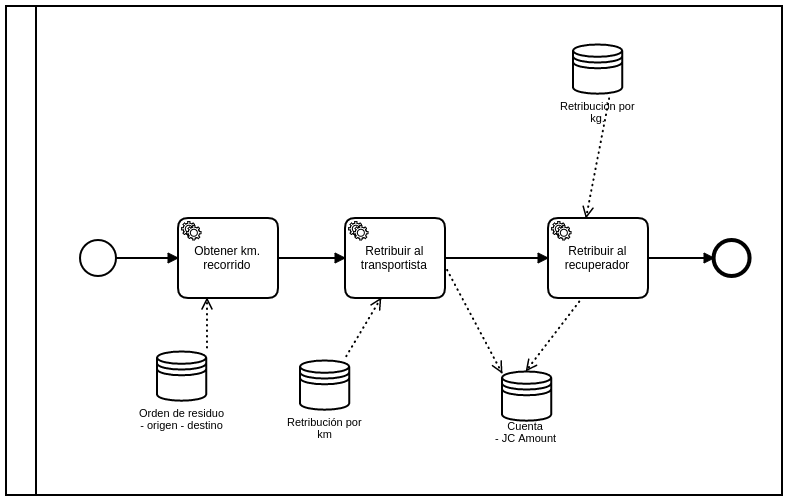

## Detalle del proceso
### Obtener km. recorrido:
En base a una orden de residuo se contabilizan la distancia entre el origen (ubicación del recuperador) y el destino (ubicación del CR)
### Retribuir al transportista:
Según la cantidad de kms recorridos se le depositará una cantidad de JC en la cuenta del transportista
### Retribuir al recuperador:
Según la cantidad de kgs. Se le depositará una cantidad de JC en la cuenta del recuperador.

## Parametrización Retribución
- Tipo de residuo (opcional)
- Unidad de medida (km/kg)
- JC (cantidad de JC que equivale 1km. o 1 kg. - también se puede plantear al revés esta relación, cuandos km/kg equivalen 1 JC)

## Parametrización huella de carbono
- Udm
- CO2

## Retribución
- Cantidad JC
- Cuenta origen: centro de reciclaje
- Cuenta destino
- Validado por
- Accion (por tipo de retribución)
- UdM
- Udm_amount
- Fecha y hora de creación
- Cantidad co2

## Recuperador -> transp -> CR/PV

- Retribución al recuperador (por los kgs.)
- Retribución al transportista (por kms. + Kgs)
- Retribución al punto verde (por almacenamiento-tiempo y kg.)
- Al recuperador no se le retribuye por acopio
- El punto verde recibe residuos de terceros

## Parametrización tipo de retribución:
- Recuperación - Al recuperador
- Transporte - Al transportista
- Almacenamiento - Al punto verde

## Valor de JC
- 10 botellas = 100 gr. = 1 JC
- 10 JC / KM

