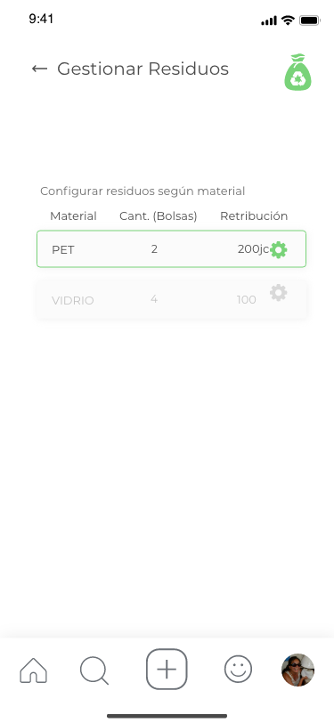
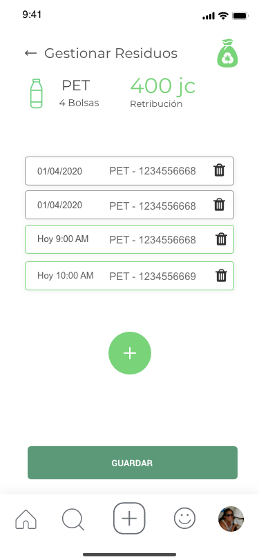
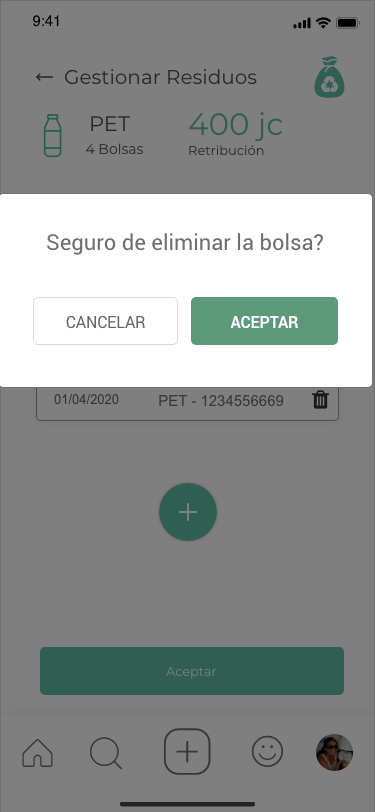

Esta opción permite modificar el stock actual que tenga el usuario
## Paso 1: Se debe seleccionar el tipo de residuo

## Paso 2: Se puede agregar o eliminar un contenedor dado

## Paso 3: Se debe confirmar la acción

