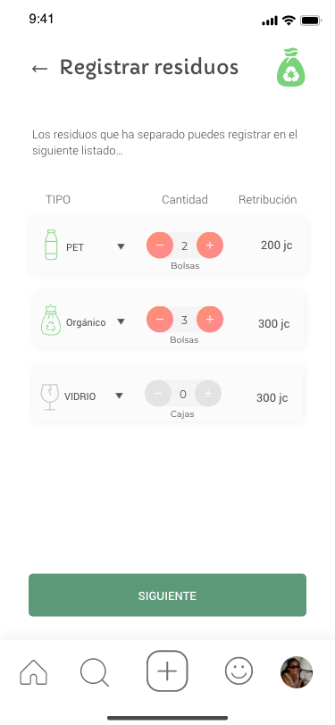
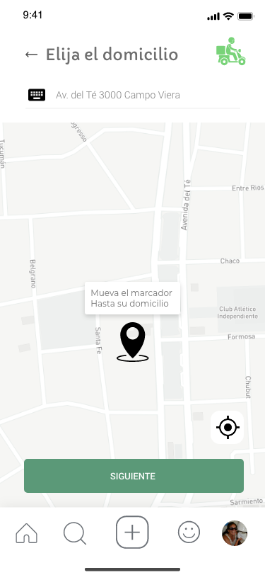
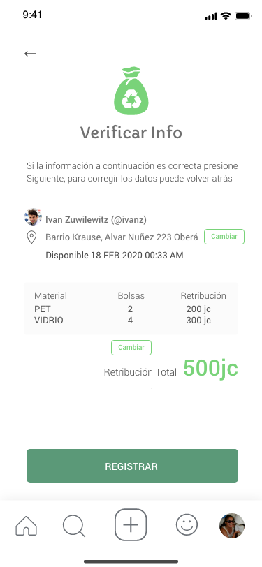

Es la acción principal que usted podrá realizar en la plataforma, posteriormente de haberlos registrado y rotulados con el numero identificador que asigna el sistema, estarán en condiciónes de ser transladados por usted u otro usuario a un centro de reciclado donde se los procesará.

## Paso 1: Seleccione la cantidad de contenedores que posea por tipo de residuo

## Paso 2: Seleccione la dirección (por defecto toma la ingresada en la cuenta)

## Paso 3: Confirme los datos ingresados

## Paso 4: El sistema generará los números de contenedores que deberá anotar en cada uno de ellos

