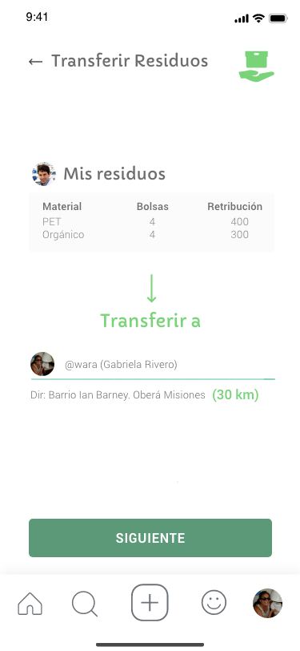
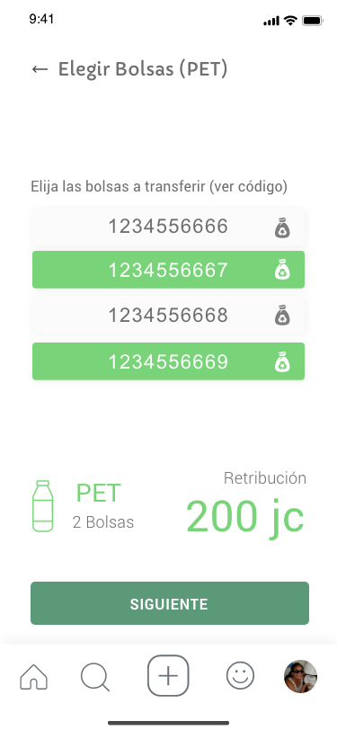
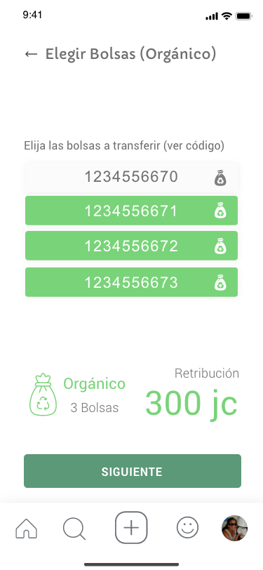
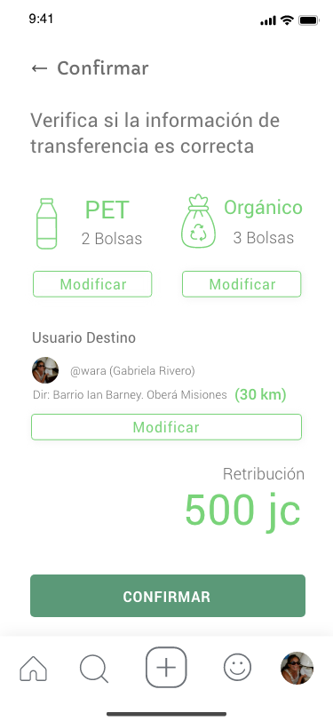
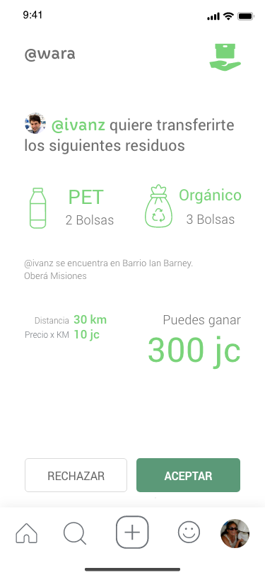
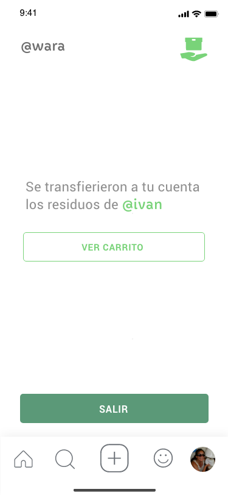
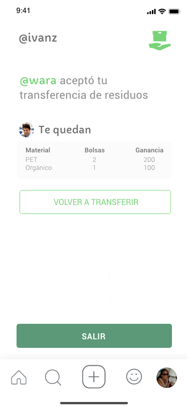
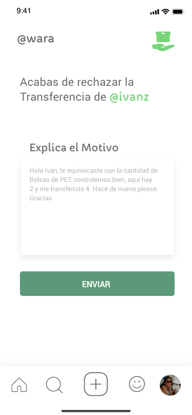
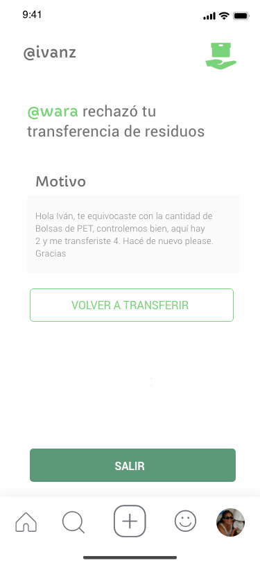

La transferencia consiste en pasar residuos del stock propio al stock de otro usuario, esto va a implicar que una vez aceptada la transferencia el usuario destino retire los residuos transferidos

## Paso 1: Seleccionar destinatario

## Paso 2: Seleccionar residuos por tipo
### PET

### Orgánico

## Paso 3: Confirmar transferencia

## Paso 4: El usuario destino recibe solicitud de transferencia

## Paso 5a: Residuos aceptados

## Paso 5b: El usuario origen recibe la aceptación

## Paso 6a: Residuos Rechazados

## Paso 6b: El usuario origen recibe el rechazo

