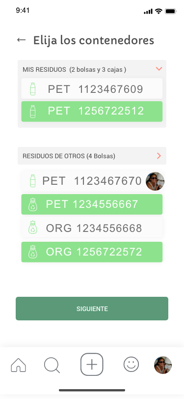
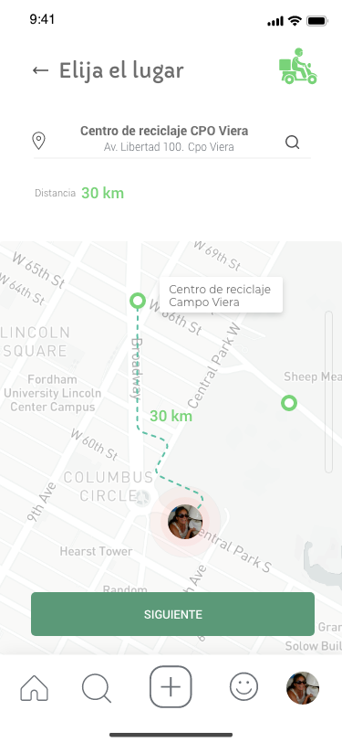
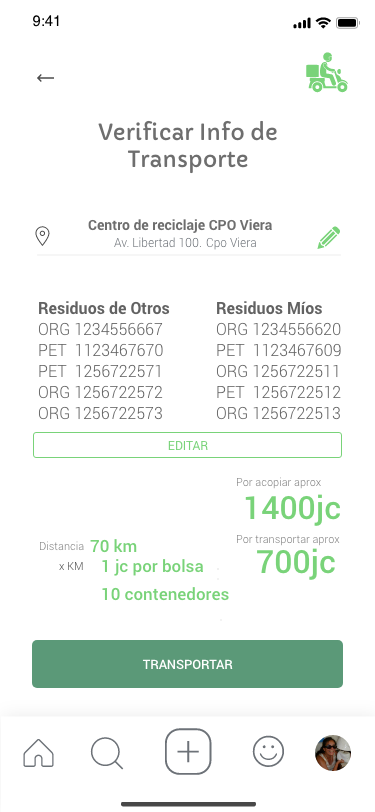
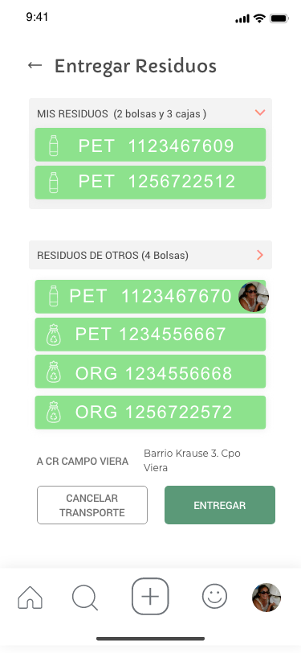
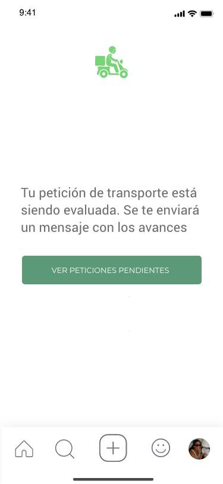
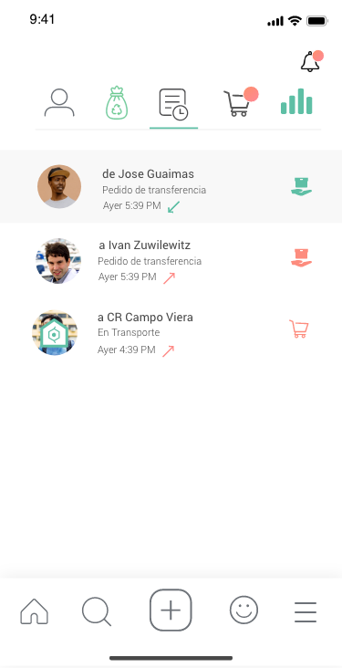
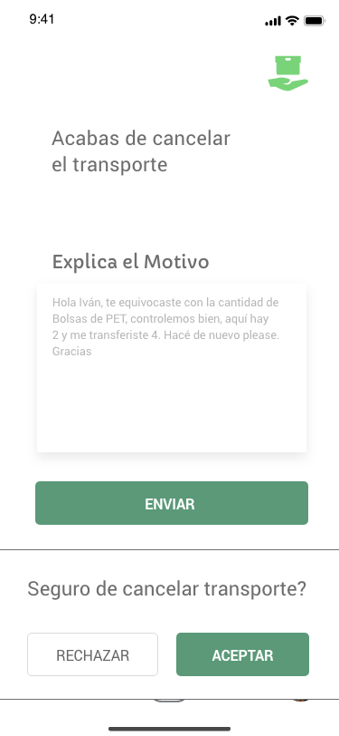

Una vez que se registró residuos y/o que se le fue transferidos residuos de otros usuarios, se deben transladar los mismo al centro de reciclado más cercano en donde se validarán los mismos, procesarán y se retribuirá la labor de haber registrado y trasladados dichos residuos a ese punto.

## Paso 1: Seleccionar contenedores

## Paso 2: Seleccionar centro de reciclado

## Paso 3: Confirmar Transporte

## Paso 4: Entregar residuos

## Paso 5: Residuos entregados

### Peticiones pendientes

## Paso 6: Transporte cancelado

